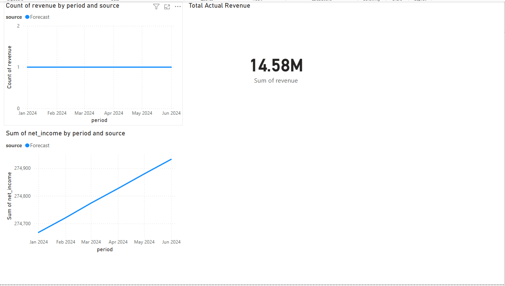

# Enterprise Financial Forecasting System

A senior-level financial data analytics solution that forecasts revenue and net income using Python, PostgreSQL, Excel, and Power BI.

## 🔧 Tools Used
- **Python** (Pandas, NumPy)
- **PostgreSQL**
- **Power BI**
- **Excel**
- **Git & GitHub**

## 📊 Project Overview
This project simulates a corporate financial forecasting pipeline that:
- Loads actual financial data and generates monthly revenue forecasts
- Automates data ingestion from Excel into PostgreSQL
- Visualizes actual vs forecasted KPIs in Power BI dashboards
- Supports executive decision-making with dynamic filters and trend analysis

## 📸 Dashboard Preview

## 🚀 Key Features
- Forecast vs Actual comparison of Revenue and Net Income
- ETL pipeline: Excel → Python → PostgreSQL → Power BI
- Time period filtering, slicers, and KPI cards
- Built for finance teams needing monthly visibility on performance

## 📬 Contact
Yengkong Sayaovong  
📧 [ysayaovong@gmail.com](mailto:ysayaovong@gmail.com)  
🌐 [LinkedIn](https://linkedin.com/in/YOUR-LINKEDIN)

---

> 📌 *This is part of my Financial Data Analyst portfolio — built to demonstrate forecasting, ETL, and dashboarding capabilities at a senior level.*

